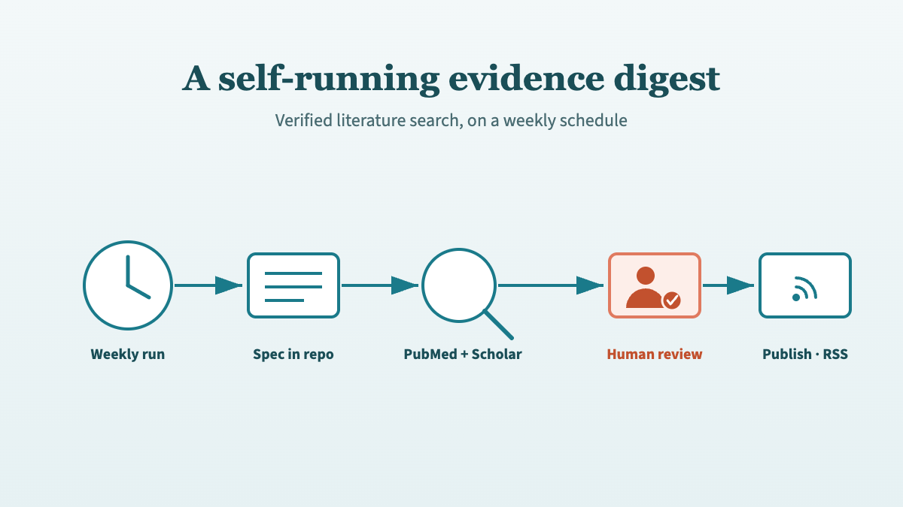

{fig-alt="Flat vector illustration of an automated literature surveillance pipeline: a weekly clock icon feeds a version-controlled spec file, which drives parallel PubMed and Scholar Gateway searches, flowing through a verification step into a pull request marked for human review, then out to a published digest with an RSS feed, in teal and coral"}

PubMed holds more than 36.5 million citations and grows by about 1.57 million every year ([NLM, FY2023](https://www.nlm.nih.gov/bsd/medline_pubmed_production_stats.html)). No clinician reads even a fraction of their own sub-specialty's share of that. Kidney transplantation alone produces a steady weekly stream of trials, registry analyses, and guideline updates, and keeping current is a job that never finishes. So I built something to do the first pass for me.

[Kidney Transplant Watch](/briefings.qmd) is a weekly, AI-generated digest of new kidney transplant literature, published as a public section of [this site](/posts/plans/). Each issue is written by [Claude](https://claude.ai), every citation is verified against PubMed, and a human reviews it before it ever goes live. This post is the build log: how it runs unattended, why it's built the way it is, and the decisions that keep AI-generated clinical content safe enough to publish.

It's the next step in a sequence I've written about here before. I started with a [manual workflow for searching the literature without hallucinating citations](/posts/ai-literature-search/), then [codified that workflow into a reusable Claude skill](/posts/literature-review-skill/), then [turned its verified evidence into structured review documents](/posts/search-result-to-structured-doc/). Kidney Watch is the same verified-citation engine again — only now it runs itself on a schedule and publishes to the open web.

:::{.callout-tip}
## Key Takeaways

- Kidney Watch is generated by a scheduled Claude routine that runs weekly (Saturday 01:00 UTC) on Opus 4.8, searches PubMed and Scholar Gateway, and selects up to 8 of the most significant new papers.
- The generation spec lives in the repository, not in the automation. Tuning the digest means editing one Markdown file via a reviewable pull request.
- Every issue lands as a GitHub pull request for human review before publishing — non-negotiable for AI-generated medical content. The automation can open a PR, never push to `main`.
- Verbatim citations plus own-words summaries kill the two worst failure modes at once: 56% of AI-generated medical citations have been found to be fabricated or wrong ([Linardon et al., JMIR Mental Health, 2025](https://mental.jmir.org/2025/1/e80371)).
:::


## Why automate a literature search at all?

Guidelines and the evidence under them go stale on a clock. A [2014 CMAJ analysis](https://doi.org/10.1503/cmaj.140547) found 1 in 5 recommendations were out of date just three years after publication, and an [earlier JAMA study](https://doi.org/10.1001/jama.286.12.1461) concluded that half of clinical guidelines were obsolete by 5.8 years, recommending reassessment every three years. Surveillance is not a one-off task. It's maintenance.

A manual search is the right tool for a specific clinical question. You frame it, run it, appraise the results, and move on. But "what's new in kidney transplantation this week?" isn't a question you ask once. It's a standing watch, and a standing watch is exactly the kind of repetitive, easily-forgotten task that automation is good at and humans are bad at.

The [literature-search skill](/posts/literature-review-skill/) already solved the hard part: separating generation from retrieval, building references from real PubMed metadata, and verifying every citation. <!-- [UNIQUE INSIGHT] --> The insight behind Kidney Watch was that those same guarantees don't need a human in the loop to *start* the search — only to *approve* the result. Once the safeguards are structural rather than habitual, you can move the human from the keyboard to the review gate and let a schedule do the typing.

That reframing is the whole project: take a workflow a clinician runs by hand, make every safety property enforced rather than remembered, and then let it run on its own.


## How is a weekly issue generated?

Each issue is produced by a scheduled [Claude cloud routine](https://docs.anthropic.com/en/docs/claude-code) that fires weekly — Saturday at 01:00 UTC, on the cron expression `0 1 * * 6` — running on Claude Opus 4.8. The routine has the site's GitHub repository connected as a source and two evidence connectors: the [PubMed](https://pubmed.ncbi.nlm.nih.gov) and Scholar Gateway MCPs, the same pairing I described in the [manual search post](/posts/ai-literature-search/). Tools are scoped down to the minimum the job needs.

The routine prompt itself is deliberately thin. Its real instruction is just "read the spec and follow it exactly"; only the safety-critical rules are restated, deliberately duplicated so they hold even if the spec is misread:

```text
You generate the weekly Kidney Watch digest for the Quarto site
repository you have checked out
(https://github.com/Laszlo75/portfolio-website).

Read the file briefings/_state/INSTRUCTIONS.md in the repository and
follow it EXACTLY — it is the single source of truth for scope, search
rigour, the verification and copyright rules, the .qmd output format,
dedup, and the pull-request mechanics.

Constraints (also stated in INSTRUCTIONS.md, repeated here for safety):
- Use ONLY the PubMed and Scholar-Gateway connectors for evidence.
  Do not fabricate anything.
- Open a pull request targeting main. NEVER push directly to main.
- Modify ONLY files inside the briefings/ directory. Do not render
  Quarto.

If briefings/_state/INSTRUCTIONS.md is missing, stop and report that
rather than improvising a format.
```

Everything else that defines the digest — scope, lookback window, verification rules, output format — lives in that file, not in the automation. The contrast is the whole point: a short, stable prompt pointing at a long, versioned spec. More on why that matters in a moment.

A single run walks through a fixed sequence: load the list of papers already covered, search PubMed for kidney transplant articles from the last 14 days, drop anything seen before, then select up to eight of the most clinically significant — randomised trials, large registry or cohort studies, major-journal papers, guideline updates. For the papers that warrant it, the routine pulls full text from PubMed Central. Then it writes the issue, updates its memory of what it has covered, and opens a pull request.

```{=html}
<figure role="img" aria-label="Pipeline diagram of the Kidney Watch generation flow. A weekly routine running Saturday at 01:00 UTC on Opus 4.8 reads a version-controlled spec file (INSTRUCTIONS.md). The spec drives two parallel evidence searches: PubMed for keyword and MeSH queries, and Scholar Gateway for semantic search. Both feed a verification and drafting step that writes a Quarto .qmd digest. That draft becomes a GitHub pull request, highlighted as the human-review gate, which on merge is published to GitHub Pages with an RSS feed.">
<svg xmlns="http://www.w3.org/2000/svg" viewBox="0 0 960 280" style="width:100%;max-width:960px;height:auto;display:block;margin:2rem auto;">
  <defs>
    <marker id="kw-arrow" viewBox="0 0 10 7" refX="10" refY="3.5" markerWidth="8" markerHeight="6" orient="auto-start-auto">
      <path d="M 0 0 L 10 3.5 L 0 7 z" fill="#1a7a8a"/>
    </marker>
  </defs>
  <style>
    .kwd-box { fill: #f8f9fa; stroke: #1a7a8a; stroke-width: 2; }
    .kwd-box-accent { fill: #e8f4f6; stroke: #1a7a8a; stroke-width: 2; }
    .kwd-box-gate { fill: #fdeee9; stroke: #e07a5f; stroke-width: 2.5; }
    .kwd-label { font-family: 'Source Sans 3', sans-serif; font-size: 12px; fill: #333; text-anchor: middle; }
    .kwd-bold { font-family: 'Source Sans 3', sans-serif; font-size: 13px; fill: #1a7a8a; font-weight: 700; text-anchor: middle; }
    .kwd-gate { font-family: 'Source Sans 3', sans-serif; font-size: 13px; fill: #c2512e; font-weight: 700; text-anchor: middle; }
    .kwd-connector { stroke: #1a7a8a; stroke-width: 2; fill: none; marker-end: url(#kw-arrow); }
  </style>
  <!-- Weekly routine -->
  <rect class="kwd-box" x="15" y="112" width="120" height="56" rx="8"/>
  <text class="kwd-bold" x="75" y="136">Weekly run</text>
  <text class="kwd-label" x="75" y="153">Sat 01:00 · Opus</text>
  <!-- Spec -->
  <rect class="kwd-box-accent" x="177" y="112" width="120" height="56" rx="8"/>
  <text class="kwd-bold" x="237" y="136">Spec in repo</text>
  <text class="kwd-label" x="237" y="153">INSTRUCTIONS.md</text>
  <!-- PubMed -->
  <rect class="kwd-box-accent" x="339" y="46" width="120" height="56" rx="8"/>
  <text class="kwd-bold" x="399" y="70">PubMed</text>
  <text class="kwd-label" x="399" y="87">keyword / MeSH</text>
  <!-- Scholar -->
  <rect class="kwd-box-accent" x="339" y="178" width="120" height="56" rx="8"/>
  <text class="kwd-bold" x="399" y="202">Scholar Gateway</text>
  <text class="kwd-label" x="399" y="219">semantic search</text>
  <!-- Verify + draft -->
  <rect class="kwd-box" x="501" y="112" width="120" height="56" rx="8"/>
  <text class="kwd-bold" x="561" y="136">Verify + write</text>
  <text class="kwd-label" x="561" y="153">.qmd digest</text>
  <!-- Pull request (gate) -->
  <rect class="kwd-box-gate" x="663" y="112" width="120" height="56" rx="8"/>
  <text class="kwd-gate" x="723" y="136">Pull request</text>
  <text class="kwd-label" x="723" y="153">human review</text>
  <!-- Publish -->
  <rect class="kwd-box" x="825" y="112" width="120" height="56" rx="8"/>
  <text class="kwd-bold" x="885" y="136">Publish</text>
  <text class="kwd-label" x="885" y="153">Pages · RSS</text>
  <!-- Connectors -->
  <line class="kwd-connector" x1="135" y1="140" x2="175" y2="140"/>
  <line class="kwd-connector" x1="297" y1="140" x2="337" y2="74"/>
  <line class="kwd-connector" x1="297" y1="140" x2="337" y2="206"/>
  <line class="kwd-connector" x1="459" y1="74" x2="499" y2="140"/>
  <line class="kwd-connector" x1="459" y1="206" x2="499" y2="140"/>
  <line class="kwd-connector" x1="621" y1="140" x2="661" y2="140"/>
  <line class="kwd-connector" x1="783" y1="140" x2="823" y2="140"/>
</svg>
<figcaption style="text-align:center;font-size:0.85rem;color:#666;margin-top:0.5rem;">The weekly pipeline: a thin scheduled routine reads a version-controlled spec, runs dual evidence searches, verifies and drafts the issue, then routes it through a human-reviewed pull request before publishing.</figcaption>
</figure>
```

The clinician's job in this design isn't to run the search. It's to read one pull request a week and decide whether it's fit to publish.


## Why does the spec live in the repository?

The single most important design choice was putting the generation spec in the repo rather than in the automation. [`briefings/_state/INSTRUCTIONS.md`](https://github.com/Laszlo75/portfolio-website/blob/main/briefings/_state/INSTRUCTIONS.md) is a version-controlled, publicly readable Markdown file that defines everything: the scope (kidney transplant only, written for a UK consultant audience), the 14-day lookback window, the verification and copyright rules, the exact `.qmd` output format, the empty-window guard, and the pull-request workflow. The routine just points at it.

That separation buys a lot. Because the spec is in git and the automation is thin, **tuning the digest means editing one Markdown file** — and that edit goes through the same pull-request review as any other change. The format is version-controlled, sits in history, and is decoupled from the platform running it.

This is the citation capsule worth taking away: keep the generation spec under version control and make the automation a thin pointer to it. The format becomes tunable through a reviewable diff, every change is auditable in git history, and the whole thing is portable — swap the scheduled routine for a different runner and the spec carries over untouched. Configuration that lives inside an automation platform has none of those properties.

<!-- [PERSONAL EXPERIENCE] --> In practice this means I tune the digest the way I tune code. When I wanted the reference lines smaller and quieter, or the overview written as a thematic synthesis rather than a list, I edited the spec, opened a PR, and reviewed the diff — not a settings panel buried in a dashboard.


## How are citations kept honest?

This is the part that matters most for clinical content, because the failure mode is severe. When researchers tested GPT-4o on mental health literature reviews, 56% of citations were fabricated or contained errors, and 20% were entirely invented ([Linardon et al., JMIR Mental Health, 2025](https://mental.jmir.org/2025/1/e80371)). Worse, most fabricated DOIs resolved to real but unrelated papers — the kind of error that survives a casual check. A digest that did that weekly would be worse than no digest at all.

The spec splits citations into two halves with different rules. The identifiers — PMID, DOI, title, full author list, journal, year — are copied **verbatim** from the PubMed metadata. DOIs are opaque strings; there's no way to reconstruct one from memory, so the rule is to copy, never reconstruct. Everything else — the overview and every paper summary — must be written **entirely in the model's own words**, with no abstract sentences copied across. The article title is the only prose reproduced verbatim, because that's standard citation practice.

That split defuses two dangers at once. Copying identifiers eliminates citation hallucination, the way the [reference ledger](/posts/literature-review-skill/) does in the manual skill. Transforming everything else into original prose eliminates the copyright and plagiarism risk of regurgitated abstracts. Every statistic in a summary has to be grounded in the abstract or full text actually retrieved that run; if any detail can't be verified, the rule is to omit the paper rather than guess.

<!-- [PERSONAL EXPERIENCE] --> One lesson came from a near-miss. A delayed-graft-function percentage in a draft looked invented to me — it wasn't in the abstract — and I almost flagged it as a hallucination. It was real. The figure lived in a results table in the full text, which the routine had correctly retrieved. The takeaway went straight into the spec: trust full text, not just abstracts, for the numbers, because some of the most important figures never appear in the abstract at all.


## Why is every issue a pull request?

Every Kidney Watch issue lands as a GitHub pull request that a human reviews before merge. The automation can open a PR; it cannot push to `main`. For AI-generated medical content this isn't a nicety — it's the control that makes the whole thing publishable, and I'd treat it as non-negotiable for any clinical content an AI produces.

The pull request is where the rare bad output gets caught: a misread statistic, a paper that's out of scope, a summary that overstates a finding. Reviewing a well-formatted diff of eight summaries takes a few minutes, and it's a fundamentally different cognitive task from writing them — appraisal, not authorship, which is exactly where a clinician's judgement is best spent. <!-- [UNIQUE INSIGHT] --> Auto-publishing would save those few minutes and forfeit the one safeguard that no amount of clever prompting can replace: a domain expert looking at the result before the public does.

If a quiet week produces nothing worth including, the routine opens no pull request at all (more on that below). So the review burden is exactly calibrated to the signal: a PR only ever exists when there's something real to publish.


## How does it never miss or repeat a paper?

A small JSON file does the bookkeeping. `briefings/_state/seen.json` records the PMID of every paper ever covered; each run appends the new ones. Before selecting anything, the routine loads that list and excludes everything on it. That's what lets the search window be deliberately generous without producing duplicates.

The window is 14 days on a weekly cadence — a deliberate one-week overlap. PubMed indexes papers on a lag, so a strict seven-day window would quietly miss anything indexed late. The overlap catches those stragglers; the dedup state guarantees that catching them twice never turns into printing them twice. A persistent list plus an overlapping window beats trying to engineer a perfect, gap-free schedule, and it costs one tiny file.

The flip side is the empty-window guard. If, after deduplication, there's nothing genuinely notable, the routine creates no post, makes no commit, and opens no PR — it reports "no new notable items this week" and stops. Letting the automation publish *nothing* is a feature. It keeps the feed free of filler and protects its credibility; a digest that pads a slow week with marginal papers teaches readers to stop trusting it.


## What keeps the automation safe and the pipeline clean?

Least privilege is the rule for anything that can touch a public repository. The routine gets a scoped tool allowlist — the two evidence connectors plus the ability to open a pull request — not blanket permissions, and it can never push to `main`. The blast radius of a bad run is therefore a closeable PR, nothing more.

Publishing is handled separately. On merge, a GitHub Actions workflow (`publish.yml`) renders the Quarto site with R and Quarto and deploys to GitHub Pages, with Cloudflare in front. The listing page sets `feed: true`, which generates an [RSS feed](/briefings.qmd) so readers can subscribe rather than checking back. There were two ways to run generation — a GitHub Actions cron job invoking Claude inside CI, or a Claude cloud routine that operates on the repo and opens PRs. I chose the cloud routine; the in-CI workflow file exists but sits unused. The routine keeps the model and the evidence connectors in one managed place, and the repo only ever receives a clean pull request.


## Why is it designed for triage rather than decoration?

A weekly digest's real job is to let a busy clinician decide what to read in seconds, so the presentation is built for triage. Custom CSS gives each issue a clear reading hierarchy: a serif "In brief" overview that synthesises the week thematically, an accent rule, then numbered entries with quiet, small-print reference lines. The structure isn't styling for its own sake — it's a usability decision.

The overview comes first because it's the part most readers will act on: skim the themes, decide whether anything this week touches your practice, and only then drill into the entries that do. The reference lines are deliberately demoted so the eye lands on the summary, not the bibliographic apparatus. A clinician should be able to triage the whole issue at a glance and spend their attention only where it earns its keep.

You can see the result running live on the [Kidney Transplant Watch](/briefings.qmd) page, and subscribe to the feed if you want each issue as it publishes. It's offered as a free, transparent example of an AI-assisted evidence workflow — explicitly not a substitute for reading the primary sources. As a [transplant surgeon](/resume.qmd), that distinction matters to me: the digest tells you what to read, not what to conclude.


## Frequently asked questions {#faq}

### Is Kidney Watch a substitute for reading the papers?

No. It's a triage layer, not a verdict. Every issue carries a callout flagging it as AI-generated and asking readers to verify each item against the source, and PubMed is credited as the origin of all metadata. The digest is designed to help a clinician decide what's worth reading this week — the clinical judgement stays with the reader and the primary source.

### How does it avoid hallucinated citations?

By copying, not recalling. The PMID, DOI, title, authors, journal, and year are taken verbatim from PubMed metadata, never reconstructed from memory, and every summary statistic must be grounded in the abstract or full text retrieved that run. This matters because 56% of AI-generated medical citations in one study were fabricated or wrong ([Linardon et al., JMIR Mental Health, 2025](https://mental.jmir.org/2025/1/e80371)).

### Why a pull request instead of publishing automatically?

Because AI-generated medical content needs a human gate. Every issue is a GitHub pull request reviewed before merge — the point where a misread statistic, a mis-scoped paper, or an overstated finding gets caught before it's public. The automation can open a PR but can never push to the live branch, so the worst case is a pull request someone closes.

### Could this pattern work for other specialties?

Yes. Nothing in the architecture is kidney-specific. The scope, audience, and search terms all live in one version-controlled spec file, so adapting it to another sub-specialty means editing that Markdown spec — not rebuilding the automation. The same verified-citation rules, dedup state, and pull-request gate carry over unchanged.

### How does it avoid repeating papers week to week?

A small `seen.json` file records the PMID of every paper ever covered, and each run excludes everything already on that list. That lets the search use a deliberately overlapping 14-day window on a weekly cadence, so papers PubMed indexes late are still caught — without the overlap ever producing a duplicate in the published feed.
