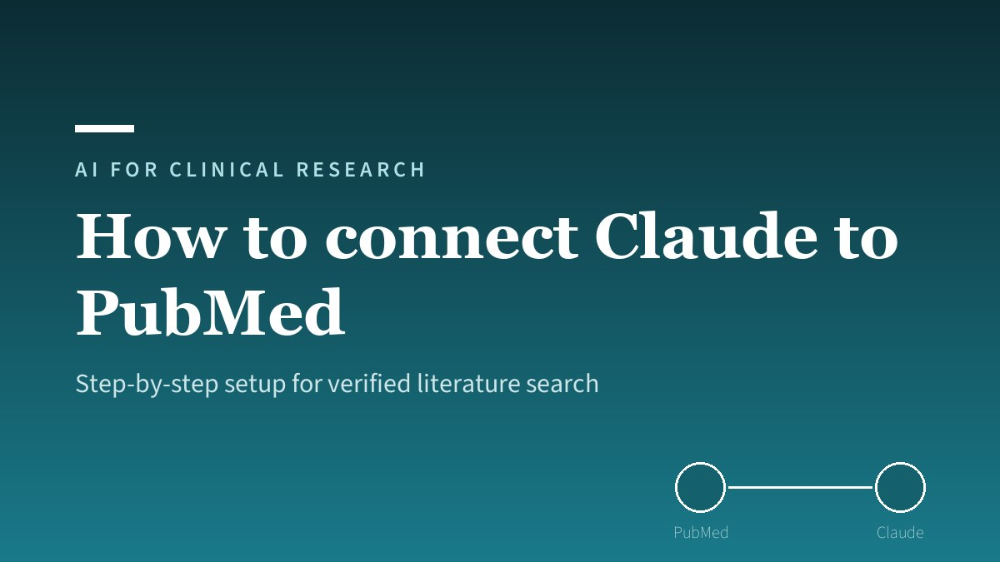

{fig-alt="A laptop showing PubMed search results connected by glowing data streams to the Claude interface, representing a live database connector"}

Connecting Claude to PubMed turns the model from a confident guesser into a grounded research tool. Out of the box, an LLM that recalls a citation from memory can fabricate the PMID, the author list, or the p-value. The **PubMed connector** closes that gap: Claude queries the live PubMed API and returns real PMIDs, real abstracts, and real author lists. This is the single most important setting for anyone using Claude for [medical literature search](/posts/ai-literature-search/).

This is a focused setup guide: how to enable the connector, what it can and cannot do, the prompts that get the most out of it, and a 30-second routine to verify every result before you cite it.

:::{.callout-tip}
## Key Takeaways

1. **Enable PubMed under Settings → Connectors** — on [claude.ai](https://claude.ai) or in the Claude desktop app — it is the difference between retrieval and recall.
2. **Always ask for PMIDs.** They are your verification handle; a citation without one is a red flag.
3. **The connector retrieves; you still verify.** Look up the PMID, confirm the journal and authors, and check that any quoted statistic appears in the abstract.
4. **Add Scholar Gateway and bioRxiv/medRxiv** from the same page for broader literature and preprints.
:::

## How Do I Connect Claude to PubMed?

To connect Claude to PubMed:

1. Open [claude.ai](https://claude.ai) in your browser, or the **Claude desktop app** (Mac or Windows) — the interface many researchers use day to day. The steps are identical in both.
2. Go to **Settings → Connectors**.
3. Find **PubMed** in the list and toggle it **on**.

That is the whole setup. There is nothing to install and no API key to paste. Once the connector is active, Claude can query [PubMed](https://pubmed.ncbi.nlm.nih.gov) directly during a conversation and return verified PMIDs, titles, and abstracts. Because those citations come from the database rather than the model's weights, they are real and checkable — not pattern-completed guesses.

The connector is configured through MCP (Model Context Protocol), the open standard Claude uses for real-time tool access to external systems. You do not need to understand MCP to use it; you only need to know that an enabled connector means Claude is reading from a live source, not reciting from memory.

## What Can the PubMed Connector Do?

With the connector active, Claude can run a search against the live PubMed API and hand back structured, verifiable results. A typical request:

```
Search PubMed for randomised controlled trials on belatacept versus calcineurin
inhibitors in kidney transplant recipients, published since 2018. Return titles,
PMIDs, and a one-sentence summary of each.
```

Claude executes the query and returns each paper with its PMID. From there you can drill in without leaving the conversation:

- **Retrieve abstracts:** *"Retrieve the abstract for each paper and summarise the primary outcome."*
- **Check a specific number:** *"What does the abstract specifically say about graft survival at 12 months? Quote it directly."*
- **Refine the search:** narrow by date, study type, or population and re-run.

The connector is best treated as a retrieval engine that hands verified text to Claude's reasoning. Let PubMed find and confirm the papers; let Claude help you read, compare, and synthesise them.

## What Tools Does the PubMed Connector Have?

The connector is not a single search box — it exposes a set of distinct tools that Claude calls as needed during a conversation. Knowing what is available helps you ask for exactly the right operation:

| Capability | What Claude can do with it |
|---|---|
| **Search articles** | Query PubMed with keywords, field tags (`[Title]`, `[Author]`, `[Journal]`, `[MeSH Terms]`, `[Publication Type]`), Boolean operators, date ranges, and sort order |
| **Get article metadata** | Pull full details for one or more PMIDs — title, authors, journal, abstract, and DOI |
| **Get full text** | Retrieve the complete text of open-access articles from PubMed Central (PMC), where available |
| **Find related articles** | Surface similar papers by title/abstract/MeSH similarity, or linked full text, genes, proteins, and sequences |
| **Look up by citation** | Match a reference (journal, year, volume, page, author) back to its PMID |
| **Convert IDs** | Translate between PMID, PMCID, and DOI |
| **Check copyright status** | Report licensing — for example open access or CC BY — before you reuse content |

Two of these are quietly powerful for keeping your work honest. **Look up by citation** lets you hand Claude a reference from a draft and confirm it resolves to a real PMID — the fastest way to catch a fabricated citation. **Check copyright status** tells you whether an article can be reused, which matters when you are assembling a systematic review or reproducing a figure. Note that full text is only available for the roughly six million articles deposited in PMC; for everything else, the connector still returns the verified abstract and metadata.

## What Are the Best Prompts for the PubMed Connector?

The connector rewards a precise, well-scoped question. Frame your clinical question in **PICO format** (Population, Intervention, Comparison, Outcome) and ask Claude to build the search before it runs it:

```
I am preparing a grant background section on DCD versus DBD kidney transplantation.
Key outcomes: delayed graft function, 1-year graft survival, eGFR at 12 months.
Time frame: 2015–2025. Study types: RCTs, cohorts n>100, systematic reviews.

Generate a PubMed Boolean search string with MeSH terms, then run it via the
connector and return titles, PMIDs, and a one-line summary of each result.
```

Two habits make the output trustworthy:

- **Always request PMIDs alongside every citation.** They are the handle you use to verify.
- **When synthesising, pin Claude to the retrieved set:** *"Use only the papers from this search. Do not add citations from memory."* This keeps the final reference list grounded in what the connector actually returned.

## How Do I Verify the Results Aren't Hallucinated?

The connector dramatically reduces hallucination, but verification is still your job — especially for anything entering a manuscript or protocol. For every paper that makes it into your final document, spend about 30 seconds:

1. **Look up the PMID** on [PubMed](https://pubmed.ncbi.nlm.nih.gov).
2. **Confirm the author list and journal** match what Claude reported.
3. **Check that any quoted statistic** appears in the abstract or full text — not just in Claude's summary.

Watch for these red flags, which usually mean a claim came from memory rather than the connector:

- A citation with no PMID, or a PMID that returns no results on PubMed.
- A journal name that sounds plausible but unfamiliar — check it in the [NLM catalogue](https://www.ncbi.nlm.nih.gov/nlmcatalog).
- Precisely stated statistics that were not sourced from a retrieved abstract.
- A confident, specific clinical answer given *without* Claude invoking the connector.

The simple test: **"What PMID supports that?"** If Claude cannot produce a verifiable one, treat the claim as unverified.

## Can I Connect Claude to Other Databases Too?

Yes. From the same **Settings → Connectors** page you can enable two more sources that complement PubMed:

- **Scholar Gateway** — broader peer-reviewed literature beyond MEDLINE's scope, useful for health economics, implementation science, or policy questions.
- **bioRxiv / medRxiv** — preprints, giving you the latest work before peer review. Always flag preprint status in your prompt (*"mark each result as [PREPRINT — not peer reviewed]"*), because findings may change.

Enabling PubMed and Scholar Gateway together lets you ask a single question that spans clinical trials and economic analyses in one pass.

## Frequently Asked Questions {#faq}

**Do I need a paid Claude plan to use the PubMed connector?**

No. PubMed is a directory connector, and directory connectors — PubMed included — are available on every Claude plan, the free tier included ([Anthropic, 2026](https://claude.com/resources/tutorials/using-the-pubmed-connector-in-claude)). PubMed itself is a free public resource from the US National Library of Medicine, so there is no subscription to buy and no NCBI account to create. (Plan terms can change, but this is the position at the time of writing; a Pro or Max plan adds higher usage limits and other connectors, not access to PubMed.)

**Does the connector replace PubMed?**

No. The connector lets Claude *query* PubMed for you and reason over the results; PubMed remains the source of truth. You should still verify PMIDs and statistics before citing, exactly as you would with any search tool.

**Why ask for PMIDs every time?**

The PMID is the unique, checkable identifier for a paper. Requesting it for every citation gives you a fast way to confirm the reference is real and to pull the original abstract — the core safeguard against hallucinated references.

**What is the difference between this and pasting abstracts into Claude?**

Pasting abstracts grounds Claude in text you have already retrieved. The connector goes one step earlier: it does the retrieval itself, against the live database. The two work well together — retrieve with the connector, then paste or fetch full abstracts for close reading and synthesis.

## Where to Go Next

This guide covers the connector itself. For the wider discipline of using Claude safely on the literature — the prompt engineering, PICO search strategies, and the five habits that keep citations honest — see [Claude for medical literature search: avoid hallucinations](/posts/ai-literature-search/). To see how those habits become a repeatable, automated pipeline, read [From manual search to automated evidence pipeline](/posts/literature-review-skill/).

## More posts {.unlisted}

:::{#more-posts}
:::
