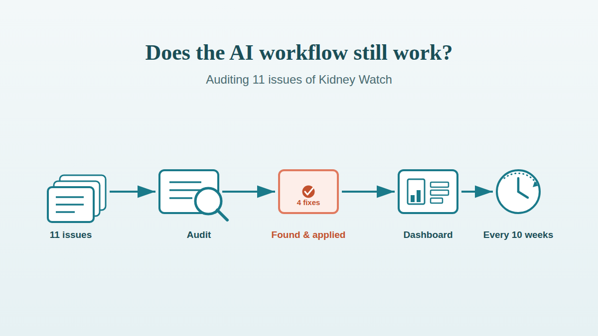

{fig-alt="Flat vector illustration of an AI workflow audit: a stack of published issues feeds a magnifying-glass checklist, which surfaces a small set of fixes, flowing into a published dashboard and a recurring recheck, in teal and coral"}

Shipping an AI workflow is the easy part. [Kidney Watch](/briefings.qmd) had been running for eleven issues — 88 papers, verified citations, a clean pull-request history — before anyone actually checked whether it was still doing what its own spec promised. That gap is common and rarely closed: teams build the safeguards, watch the first few outputs closely, then quietly stop checking once nothing obviously breaks. Eleven issues in, we closed it. This is the audit, what it found, and the checklist behind it — usable for any AI workflow, not just this one.

:::{.callout-tip}
## Key Takeaways

- An 11-issue, 88-citation audit of Kidney Watch verified every single citation live against PubMed: 88/88 correct on PMID, DOI, journal, and year; 81/88 (92%) with zero discrepancy of any kind.
- The audit found real, fixable bugs a casual read would miss: a superfluous "et al." dropped onto two already-complete author lists, two compound surnames mis-split, one dropped author, and a live tool (Scholar Gateway) that was connected but never actually used.
- Verifying an AI workflow needs the same rigour as verifying its output — one finding here turned out to be a bug in the audit's own parser, not the newsletter, caught by re-checking against the source before reporting it.
- Auditing isn't a one-off. It's now a scheduled recheck every 10 weeks, against a written methodology, so the next review doesn't start from zero.
:::

## Why audit a working AI pipeline at all?

A pipeline with a human-review gate and zero visible failures can still drift quietly, because "no one complained" and "nothing is wrong" are not the same claim. Kidney Watch's own design — every citation copied verbatim from PubMed, every issue a pull request a clinician reads before it goes live — is exactly the kind of safeguard that makes drift *invisible* rather than impossible: small errors that don't change a paper's identity (an author dropped from a 47-name byline, a title re-cased) sail through a human skim precisely because they're not the kind of error a reader is looking for.

Eleven issues is enough data for the errors that only show up in aggregate to start appearing: a pattern of superfluous "et al." tags, a journal that's never once represented despite a real supply of candidates, a tool that's been sitting connected and unused since the pipeline launched. None of those are visible from reading any single issue. They only show up when you check all of them against each other and against the ground truth — which is the actual job of an audit, distinct from the spot-checking a reviewer does issue by issue.

<!-- [UNIQUE INSIGHT] -->The instinct to skip this once a system has a good track record is exactly backwards. A system with no review gate gets checked by users immediately, because it visibly breaks. A system with a good gate — like this one — can run cleanly for months precisely because the gate catches the errors that would otherwise surface the need to look deeper.

## What actually gets checked

Auditing an AI workflow means checking it against its own stated contract, not against a generic standard — Kidney Watch's contract is the single spec file [`briefings/_state/INSTRUCTIONS.md`](https://github.com/Laszlo75/portfolio-website/blob/main/briefings/_state/INSTRUCTIONS.md), so the audit checks the pipeline's outputs against exactly what that file promises, nothing more and nothing assumed. The full checklist is written up as a standing methodology, [`AUDIT-METHODOLOGY.md`](https://github.com/Laszlo75/portfolio-website/blob/main/briefings/_state/AUDIT-METHODOLOGY.md), built so a fresh session with no memory of this one can run it again unattended.

The shape of it generalises past this one newsletter. Four questions, in order of how cheap they are to answer: **Does the output match the format it promises?** — parse every issue programmatically against the spec's stated structure, not by reading each one. **Is the bookkeeping actually correct?** — for Kidney Watch, does the dedup ledger exactly match what's been published, with no drift either direction. **Is every factual claim verifiable against its source, not just plausible?** — the expensive check, and the one that matters most for anything published as fact. **Is the selection itself good, not just accurate?** — accuracy tells you the citations are real; it says nothing about whether the *right* citations were chosen.

Most of that is nearly free. A regex sweep across all 11 issues — front matter, section structure, entry counts — took under ten tool calls and covered every issue at once, rather than sampling a few and hoping the rest matched. The category-tag tally and journal-frequency tally came out of that same pass as a free byproduct. The expensive step was always going to be citation verification, and even that turned out cheaper than expected: batch-fetching live PubMed metadata for all 88 cited papers, not a sample, took five API calls.

## The number that mattered most: Is every citation real?

Every one of the 88 papers Kidney Watch has published checked out against live PubMed on the facts that matter for finding the source: PMID, DOI, journal, and publication year were correct in all 88 entries, with zero fabricated citations anywhere in the run. That's the citation-accuracy claim the newsletter makes publicly, verified rather than taken on faith — 56% of AI-generated medical citations were fabricated or wrong in one published test of GPT-4o ([Linardon et al., JMIR Mental Health, 2025](https://mental.jmir.org/2025/1/e80371)), which is the failure mode this whole design exists to prevent, and the audit is the only way to know whether it actually is preventing it rather than just claiming to.

81 of 88 citations (92%) matched PubMed exactly on every field checked, including the full author sequence. The other 7 carried a small, specific, nameable slip — never a wrong paper, always a fine-print detail: two compound surnames split incorrectly against PubMed's own structured record ("Bot Rachisan AL" for "Rachisan AB"; "Hennawy HE" for "El Hennawy H"), one author dropped partway through an 11-name byline, two instances of a superfluous "et al." appended after the full author list had *already* been given correctly, and two titles that drifted from PubMed's exact wording — one swapping a hyphen for a comma, one expanding "vs" to "versus" and shifting to Title Case, in the issue that had just been merged when the audit ran. Every one of those is now a named, fixed rule in the spec, not a one-off correction.

The audit's own tooling needed the same scrutiny it was applying to the newsletter. A first pass flagged three "compliance errors" — a missing eighth entry in one issue, a category tag that failed vocabulary validation, an orphaned PMID in the dedup ledger — and every single one turned out to be a bug in the audit script, not the newsletter: a naive parser choking on a DOI containing an embedded parenthesis (`10.1016/S0140-6736(26)00718-X` is a real, valid Lancet DOI), and a YAML quoting difference that produced an identical parsed value either way. Re-reading the actual source before trusting an automated finding caught both. <!-- [PERSONAL EXPERIENCE] -->That's the one lesson from this audit I'd give the most weight: the tool doing the checking is not exempt from being checked.

## Was the journal sourcing actually good?

The suspicion going in was that AJT — the American Journal of Transplantation, one of the field's flagship venues — was underrepresented or missing entirely. It wasn't missing: 4 of the 88 published papers came from AJT, drawn from a real pool of 56 AJT candidates that PubMed carried in the same search windows, a 7.1% capture rate. Read alone that sounds low; read against the rest of the run it's unremarkable — even *Transplantation*, the single most-represented journal in the newsletter's 11-issue history, only captures 18.5% of its own 54 candidates, because the pipeline picks at most 8 papers a week from every journal combined, not a quota per journal. Eleven Tier-1 transplant and nephrology journals together supplied 18 of the 88 selections (20.5%) from 264 available candidates across the run — a solid showing, not a thin one.

The one journal worth a second look wasn't AJT. Two other flagship journals — CJASN and AJKD — never appeared across all 88 papers either, but sampling their actual candidate pools explained why: mostly reviews, case reports, and editorial correspondence in these exact windows, nothing that reads as a landmark trial or large registry study. *Transplant International*, by contrast, had zero representation despite two on-topic, reasonably substantial candidates sitting in its pool the whole time — a systematic review on allograft nephrectomy and a multicentre study on antibody glycosylation in rejection. Neither looks like an obvious must-have, but it's the kind of gap that only becomes visible once you check what a journal's real candidate pool actually contained, rather than reasoning from its absence in the output alone.

Evidence quality told a similar story to journal sourcing: read one way it looks thin, read correctly it doesn't. PubMed's own publication-type tagging turned up just a single explicit randomised controlled trial across all 88 papers. Taken at face value that looks like a newsletter light on rigorous evidence — but PubMed doesn't tag "registry study" or "cohort study" as a distinct publication type at all, and a manual read of the actual issues shows large OPTN, UNOS, and SRTR-scale registry analyses running through nearly every one of them, exactly the evidence tier the spec asks the pipeline to prioritise. The lesson generalises: a metric that looks authoritative because it comes from a structured field can still be measuring the wrong thing, and the fix isn't a better metric, it's reading the actual content before trusting the tag.

## The scope question the spec never quite answered

Three published entries were combined-organ transplants — bladder-kidney, heart-kidney, liver-kidney — where kidney was only one of two organs involved. The spec excluded "pancreas or other organs" from scope, but never addressed a transplant that combines kidney with something else while keeping kidney outcomes as a co-primary finding. All three summaries centred kidney-specific results, and all three had already been reviewed and merged by a human across three separate issues — which reads less like scope drift and more like a boundary the spec simply hadn't written down yet. The audit's job here wasn't to flag it as wrong; it was to make the actual, already-in-practice boundary explicit, so the next reviewer — human or automated — has a rule to check against instead of a judgment call to re-make from scratch every week. The spec now says so directly: combined-organ transplants are in scope when kidney is a co-primary outcome.

## The fix that turned out to need more than a fix

Not every finding was a one-line correction. The spec's very first line instructed the routine to "use only the PubMed and Scholar-Gateway connectors" — but the actual search steps only ever described a PubMed search. Scholar Gateway was named in the constraints and never once invoked in the mechanics, and the routine itself — a real, scheduled trigger, not a description — confirmed it: **Scholar Gateway was connected and live**, sitting unused since the pipeline launched, because the steps that would have told it to run a search never existed.

The cheap fix would have been to delete the unused mention and call the newsletter PubMed-only, matching what it had actually been doing. That's a legitimate answer for a tool that isn't there. It's the wrong answer for a tool that *is* there, live, doing nothing for no reason other than nobody had written the three steps needed to use it — so the actual fix was to wire it in properly, which turned out to need three real design decisions, not one edit.

First: Scholar Gateway returns semantic passage matches, not PubMed-style structured citations, so every result it surfaces still gets its DOI extracted and resolved to a PMID before it's allowed anywhere near a published issue — if PubMed can't confirm it exists, it's discarded, however relevant it reads, keeping the verified-citation guarantee identical regardless of which search found a paper. Second: Scholar Gateway's own date filter only works at year granularity, so the real 14-day recency check still has to run against PubMed's precise publication date after the fact, not against Scholar Gateway's coarser one. Third, and the one that would have been easy to miss without actually testing the integration before shipping it: Scholar Gateway's own response metadata self-reports its corpus as last updated several months prior to when this audit ran, which means most or all of its results will fail a 14-day recency check for the foreseeable future. That's now written into the spec explicitly, as an expected, temporary limitation rather than a bug for a future reader to rediscover and worry about.

<!-- [UNIQUE INSIGHT] -->None of that would have surfaced from reading the spec alone. It took actually calling the tool with a real query and inspecting what came back — the same standard the newsletter itself is held to for every citation it publishes, just applied one layer up, to the tooling rather than the output.

## A checklist that outlives this one newsletter

Four things generalise past Kidney Watch to any AI workflow worth checking after it ships. **Audit against the system's own stated contract**, not a generic external standard — a spec, a prompt, a set of stated guarantees; whatever the system promises is the thing to check it against. **Verify the expensive claim exhaustively, not by sampling**, when the tooling makes that nearly as cheap as sampling would have been — batch-fetching every citation cost five calls, not eighty-eight. **Re-check your own findings against the source before reporting them** — an automated audit is software too, and the parser bugs in this one were more numerous than the real defects it found. **Test any tool the system depends on before trusting what it's supposed to do**, not just what it's documented to do — a connected tool that's never actually called is a liability sitting quietly until someone checks.

The last piece is the one most teams skip entirely: **schedule the recheck**. This audit is now a standing routine that fires again in ten weeks, reading the same [written methodology](https://github.com/Laszlo75/portfolio-website/blob/main/briefings/_state/AUDIT-METHODOLOGY.md) this post describes, so the next review starts from a checklist instead of a blank page. An AI workflow that was correct on launch day and has never been checked since isn't a verified system — it's an unverified one that happened to be right the last time anyone looked.

## Frequently asked questions {#faq}

### How do you audit an AI workflow that's already in production?

Check it against its own stated contract — a spec file, a prompt, whatever the system promises — not against a generic standard. Start with what's cheap to verify exhaustively (structure, bookkeeping, internal consistency) across every output, not a sample, then spend the expensive verification (fact-checking against a primary source) on the claim that actually matters most if it's wrong.

### Is verifying 100% of outputs realistic, or do you have to sample?

It depends entirely on whether the verification tooling batches. Checking all 88 Kidney Watch citations against live PubMed cost five API calls, not eighty-eight, because the metadata tool accepts batches of up to 20 IDs at once. When the cost of checking everything is close to the cost of checking a sample, there's no reason to sample.

### What's the biggest risk in an automated audit itself?

That the audit's own tooling has bugs, and those bugs get reported as findings about the system being audited. This audit's first pass flagged three false "compliance errors" that were entirely parser bugs — a DOI containing an embedded parenthesis, a cosmetic YAML-quoting difference — caught only by re-reading the actual source file before trusting the automated result.

### How do you decide whether a connected-but-unused tool should be removed or actually used?

Test it first. Call it with a realistic query and look at what comes back — not what it's documented to return. In this case, testing surfaced a real limitation (a stale content corpus) that wouldn't have been visible from the spec or the tool's description alone, and that finding changed the design of the fix.

### How often should a working AI pipeline be re-audited?

Often enough that drift is caught before it compounds, and against a written methodology rather than reinvented each time. This project settled on every 10 weeks, run as a scheduled task against a standing checklist, specifically so each review builds on the last one instead of starting over.

## More posts {.unlisted}

:::{#more-posts}
:::
