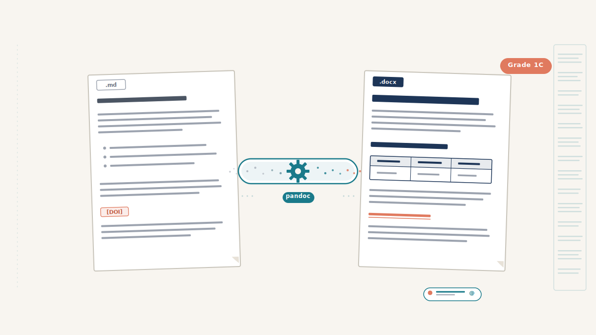

{fig-alt="Flat vector illustration of a markdown document on the left transforming through a pandoc conversion pipeline into a styled Word document on the right, with teal and coral accents showing evidence grades, clickable links, and a summary table"}

Clinical protocols age fast. A [2014 CMAJ analysis of guideline validity](https://doi.org/10.1503/cmaj.140547) tracked 113 recommendations from the Spanish national guideline programme and found that more than 1 in 5 were already outdated after 3 years; only 78% remained valid at year 4. An [earlier JAMA study](https://doi.org/10.1001/jama.286.12.1461) of 17 US Agency for Healthcare Research and Quality (AHRQ) guidelines reached the same conclusion from a different angle: more than three quarters needed updating, half had become obsolete by 5.8 years, and the authors recommended reassessing each guideline every 3 years. The picture is similar for the underlying systematic reviews: a [100-review cohort in *Annals of Internal Medicine*](https://doi.org/10.7326/0003-4819-147-4-200708210-00179) found that 23% needed updating within 2 years, and 7% were already out of date the moment they were published. Local NHS protocols inherit those clocks, and busy clinical teams struggle to keep the guidelines up to date.

The [literature-search skill](/posts/literature-review-skill/) presented in a previous post handles the search side of the problem. It hands you 25 verified references, the latest BTS and KDIGO guidelines, and a clear picture of where the protocol is out of date. The evidence is gathered, the reference ledger is built, and every DOI is verified against PubMed metadata. Now you need to turn all of that into a structured Word document that can actually be circulated, annotated, and filed. This is where most people lose a weekend.

This post describes how the [protocol-reviewer skill](https://github.com/Laszlo75/protocol-reviewer) takes a verified evidence base and generates a professional review document with evidence-graded recommendations, clickable DOI links, and Zotero-ready reference exports. It does this using a markdown-first approach that keeps the AI focused on clinical reasoning rather than Word formatting.

:::{.callout-tip}
## Key Takeaways

1. A markdown-first approach separates clinical content from document styling: the AI writes structured text, and pandoc handles the formatting
2. The five-category classification system (Aligned, Minor, Major, New, Remove) gives protocol committees a clear framework for prioritising updates
3. Evidence grades inline with every recommendation (e.g., "BTS Grade 1C") let clinicians assess recommendation strength at a glance
4. A single pandoc command converts markdown to a styled Word document with clickable DOI links, a title page, and professional formatting
5. Four output files (.md, .docx, .bib, .txt) keep the review editable, presentable, and Zotero-synchronised
:::


## Why not generate Word documents directly?

Word is a presentation format, not an authoring format. Ask an AI to generate a `.docx` directly using libraries like python-docx or docx-js, and most of its reasoning capacity goes on formatting boilerplate: paragraph styles, table cell widths, font inheritance, section breaks. The clinical content suffers because the model is juggling two fundamentally different tasks at once.

Markdown solves this by being the same structure clinicians already think in. Headings, numbered lists, tables, citations, hyperlinks: these map directly to how a protocol review is organised. The AI writes `## 3.1 Rituximab Dosing` and a paragraph of clinical reasoning. It does not write `new Paragraph({ style: "Heading2", children: [new TextRun({ text: "3.1 Rituximab Dosing" })] })`.

The separation of concerns is clean: the protocol-reviewer skill writes clinical content as structured markdown. Pandoc converts it to a styled `.docx` using a reference template that defines fonts, colours, and page layout. Neither side needs to know about the other. The clinical reasoning is better because the model is not distracted. The document is better because pandoc's typesetting is more reliable than programmatic docx generation.


## How does the cross-referencing work?

This is the analytical heart of the review. For each section of the protocol, the skill compares three sources: what the protocol currently says, what national guidelines recommend, and what recent published evidence shows. The comparison produces a classification and a recommendation.

The five classification categories are:

| Classification | Meaning |
|---------------|---------|
| **Aligned** | Protocol matches current guidelines and evidence --- no change needed |
| **Minor update** | Wording or dose adjustment needed, but the approach is sound |
| **Major update** | Significant change in practice recommended by guidelines or evidence |
| **New addition** | Topic not in the original protocol but should be, based on current evidence |
| **Remove** | Content that is outdated or no longer recommended |

"Aligned" is not filler. When I ran the first protocol review, nearly a third of sections were classified as Aligned. This is reassuring for the clinical team. It tells them the protocol is not completely out of date and focuses their attention on the sections that genuinely need work.

Each section follows a consistent structure:

```markdown
## 3.1 Rituximab Dosing

**Current protocol position:** Single dose rituximab 375 mg/m² given 4 weeks
before transplantation.

**National guideline position:** BTS recommends rituximab as part of the
desensitisation regimen, with timing 2-4 weeks pre-transplant **(Grade 1C)**.

**Recent evidence:** A 2023 meta-analysis [4] found no difference in outcomes
between single and double-dose rituximab. A UK registry study [7] confirmed
equivalent graft survival at 5 years.

**Assessment:** Aligned

**Recommendation:** No change required. Current dosing is consistent with BTS
guidelines (Grade 1C) and supported by recent evidence [4, 7].
```

The skill uses extended thinking during cross-referencing. It weighs conflicting studies, considers UK-specific regulatory context (MHRA, not FDA), and works through commissioning implications for expensive therapies before committing to a recommendation. This is a task where model capability directly affects output quality, which is why the skill specifies Claude Opus.

## Why are evidence grades non-negotiable?

When a clinician reads "BTS Grade 1C," they know instantly: strong recommendation, low-quality evidence. When they read "NICE recommends --- Strength: Strong," they know the evidence base is robust and the recommendation is directive. Without the grade, the clinician has to stop reading the review, open the guideline PDF, find the relevant section, and check the grade themselves. This defeats the purpose of the review entirely.

The protocol-reviewer skill enforces evidence grades inline with every guideline-backed recommendation. The common grading systems it uses include:

- **GRADE** (used by KDIGO, BSH, and others): Grade 1A through 2D, where 1 = strong recommendation and A = high-quality evidence
- **NICE**: Strength ratings (Strong, Conditional) with evidence quality
- **Oxford CEBM**: Levels 1-5 for individual studies, Grades A-D for recommendations
- **BTS/SIGN**: Their own grading scales, typically mapped to GRADE

Every recommendation that cites a guideline must quote the grade. Every recommendation that cites a primary study must note the study type (RCT, meta-analysis, registry study, case series). This gives the clinician the information they need to weigh recommendations without leaving the document.


## What does the review document look like?

The review follows a template with six sections, each serving a distinct purpose for the protocol committee:

**1. Executive summary** (300--500 words). The MDT can read this alone and get the key messages: how many recommendations by classification, which guidelines were consulted, and an overall assessment of the protocol's currency.

**2. Methodology.** Databases searched, date range, study types prioritised, guidelines consulted with edition dates, and the classification system explained.

**3. Section-by-section review.** The bulk of the document. Each protocol topic gets the five-part structure described above: current position, guideline position with evidence grades, recent evidence with citations, assessment classification, and recommendation.

**4. Summary of recommendations table.** Every recommendation in one place, sortable by classification. This is the at-a-glance deliverable that protocol committees use to plan their update work.

**5. Additional considerations.** Topics not in the original protocol but required by current guidelines or supported by new evidence. New drug classes, updated monitoring requirements, registry reporting obligations.

**6. References.** Numbered, with clickable DOI links and guideline URLs.

<!-- TODO: Add inline SVG diagram showing document structure flow -->


## How does pandoc convert markdown to Word?

The conversion is a single command:

```bash
pandoc review.md -o review.docx \
  --reference-doc=reference.docx \
  --from=markdown+yaml_metadata_block \
  --to=docx
```

The `reference.docx` template, bundled with the skill, defines the visual identity: Arial font, A4 page size, navy heading colours, headers and footers with page numbers. The template is a standard Word document with named styles. Pandoc maps markdown headings to Heading 1, Heading 2, etc., and inherits the formatting from the template.

YAML frontmatter in the markdown (`title`, `subtitle`, `author`, `date`) renders as a title block on the first page. A `\newpage` command after the frontmatter forces the executive summary onto page 2, creating a clean title page without any manual formatting.

The most valued feature is clickable DOI links. In the markdown, each reference includes a hyperlink:

```markdown
1. Scurt FG, et al. Clinical outcomes after ABO-incompatible renal
   transplantation. *Lancet*. 2019;393:2086.
   [DOI](https://doi.org/10.1016/S0140-6736(18)32091-9)
```

Pandoc converts this to a clickable hyperlink in the `.docx`. The clinician clicks and goes straight to the paper. No copying DOIs, no searching PubMed manually. Combined with the [reference ledger from the literature-search skill](/posts/literature-review-skill/), every link is guaranteed to resolve to the correct paper.

<!-- TODO: Add side-by-side screenshot: markdown source vs rendered Word document -->


## What output files does the skill produce?

The protocol-reviewer generates four files for each review:

| File | Purpose |
|------|---------|
| `*_Review.md` | Markdown source --- editable in any text editor for revisions |
| `*_Review.docx` | Formatted Word document for the protocol committee |
| `*_References.bib` | BibTeX file for direct Zotero import |
| `*_PMIDs.txt` | One PMID per line for Zotero bulk import |

Both the `.docx` and the `.md` source are preserved so the team can edit in whichever format suits them best. Most committees will work in Word, where track changes, comments, and circulation are already familiar; clinicians comfortable with markdown can edit the source directly and re-render into a fresh `.docx` whenever needed. Either way, the `.md` is the long-lived artefact, ready to be re-rendered to PDF or any other format pandoc supports. The `.bib` and PMIDs.txt files mean the clinician's [Zotero library](https://www.zotero.org/) stays synchronised with the review's references. Import either file and every cited paper appears in a collection ready for future use.

The skill is open source: [protocol-reviewer on GitHub](https://github.com/Laszlo75/protocol-reviewer).

<!-- **Next in this series:** Post 3 will cover the ISO 42001 governance framework --- how the transparency disclaimer, evaluation register, and audit trail fit into a formal AI governance structure for NHS clinical tools. -->


## Frequently asked questions {#faq}

### Can I customise the Word template?

Yes. The `reference.docx` in the skill's `assets/` directory is a standard Word document. Open it in Word, change the heading styles, fonts, colours, or page layout, and save. Pandoc will use your updated styles on the next conversion. The clinical content in the markdown is completely independent of the template styling.

### What if I need to edit the document after generation?

Either format works, so pick whichever suits the team.

Most clinical committees will edit the `.docx` directly in Word. Track changes, inline comments, and email circulation are built in, and the reference template keeps the styling consistent across the first few rounds of annotation. If the formatting eventually drifts after multiple reviewers have been in the document, the finalised text can be pasted back into the markdown and re-rendered into a clean `.docx` for sign-off.

Clinicians comfortable with markdown can go the other way and edit the `.md` source directly. Open it in any plain-text editor, revise the recommendation, update a citation, and re-run the pandoc command. Markdown fits naturally into version control and can be re-rendered to PDF or any other format pandoc supports.

### Can this produce PDFs instead of Word?

Pandoc supports PDF output via LaTeX or other engines, so it is technically possible. However, protocol committees in the NHS universally work with Word documents. They need to track changes, add comments, and circulate annotated versions. Word is the practical output format for this workflow. The `.md` source can be converted to any format pandoc supports if needed for other purposes.

### How long does the full review process take?

The evidence gathering phase (literature-search skill) typically completes in 15--30 minutes. The cross-referencing and document generation phase (protocol-reviewer skill) adds another 15--20 minutes, depending on the number of protocol sections. A complete protocol review, from uploading the document to receiving the `.docx`, takes 30--50 minutes of compute time plus the clinician's review time afterward. This compares to 1--2 days of manual work for a thorough evidence review and document preparation.
